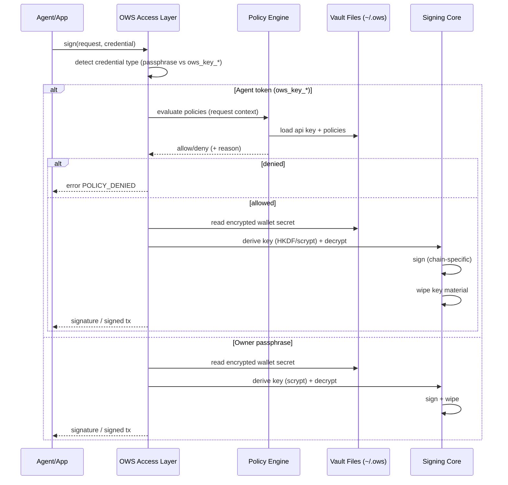

# Open Wallet Protocol Deep Research Report

## Executive summary

The newly announced “Open Wallet Protocol” corresponds, in the primary sources, to the **Open Wallet Standard (OWS) v1.0.0**: an open, **local-first** specification and reference implementation for encrypted wallet storage on a local filesystem, multi-chain account derivation, and a **policy-gated signing path** designed for AI agents and developer tooling. citeturn25view0turn26view0turn8view0

OWS’ core design goal is to solve a practical security and interoperability gap in the emerging “agent economy”: agents need to sign transactions and pay for services, but today’s integrations frequently rely on unsafe key handling (e.g., private keys in environment variables or proprietary formats) and lack portability across tools. OWS proposes **one encrypted vault on the user’s machine**, a **unified signing interface** across major chain families, and a **two-tier credential model** (owner passphrase vs scoped agent token) where **policies are evaluated before any key material is decrypted**. citeturn25view0turn23view5turn26view0turn23view0

OWS is intentionally modular: the normative core focuses on **filesystem artifacts + signing semantics + policy evaluation + lifecycle + chain identification/derivation**, while “agent access” surfaces (SDK, CLI, local services) are meant to preserve semantics without forcing a single network protocol. In practice, the reference implementation ships a Rust core with Node.js and Python native bindings plus a CLI; the ecosystem positioning also includes an MCP server interface and optional REST/local service patterns. citeturn13view4turn10view0turn11view0turn25view0turn26view0

Key strengths and differentiators:
- **Local custody + decrypt-sign-wipe** lifecycle with AES-256-GCM at rest, and KDF/HKDF separation between owner passphrases and agent tokens. citeturn23view5turn23view1turn26view0  
- **Policy engine** that supports fast declarative rules and “escape hatch” executable policies (stdin/stdout JSON), enabling limits/allowlists/simulation hooks before signing. citeturn23view0turn7view0turn25view0  
- **Multi-chain abstraction** built on CAIP identifiers and standardized derivation rules so a wallet created by one tool can be used by another. citeturn25view0turn23view4turn23view6  

Primary limitations and risks (as specified today):
- OWS **does not fully standardize a networked message protocol** (it standardizes semantics and artifacts; transports are optional profiles), which may fragment interoperability at the RPC/endpoint layer if ecosystems diverge. citeturn10view0turn8view0turn25view0  
- Current implementations **do not include a per-wallet nonce manager / request serializer**, pushing nonce coordination (and some race-condition risk) to higher-level callers. citeturn24view5turn6view1  
- OWS is **not an identity credential protocol**: DID/VC issuance, presentation formats, revocation registries, and trust-framework governance are not core-specified (though OWS can be composed as a wallet/key custody layer beneath identity stacks). citeturn25view0turn13view4turn8view0turn14search0turn14search1  

## Sources, scope, and terminology

This report prioritizes the official specification/docs site and the DeepWiki technical summary pages:
- Official docs: “Open Wallet Standard v1.0.0” overview and core type definitions, plus the specification document index. citeturn25view0  
- DeepWiki: “open-wallet-standard/core” pages covering specification scope, storage format, signing interface, policy engine, lifecycle, supported chains, security model, and release/versioning. citeturn1view0turn8view0turn23view1turn6view1turn23view0turn23view5turn7view5  

Supplementary sources are used for: (a) the announcement context and ecosystem positioning, and (b) comparison baselines for adjacent standards (W3C VC/DID, OpenID4VC, WalletConnect, FIDO/WebAuthn, and cryptographic references). citeturn26view0turn11view0turn14search0turn14search1turn14search2turn14search3turn15search3turn15search9turn16search2turn16search1turn16search0  

Terminology clarification / assumption:
- The user-requested “Open Wallet Protocol” is treated as **OWS (Open Wallet Standard)**, because the primary sources label the newly launched standard as “Open Wallet Standard v1.0.0” and describe it as the open protocol/standard for local wallet storage and policy-gated signing. citeturn25view0turn26view0  

Unspecified assumptions (explicit):
- Where the spec describes an access layer capability but does not mandate a concrete wire protocol (e.g., REST endpoint paths, exact MCP tool names), this report uses **abstract operations** and clearly labels any sample “messages/endpoints” as **reference-implementation-specific or illustrative**, not normative. citeturn10view0turn25view0turn13view4  

## Protocol goals, scope, and architecture

### Goals and scope

OWS’ stated scope is a “local-first wallet specification” defining: encrypted wallet storage on a local filesystem, signing operations, policy enforcement, and multi-chain account derivation—especially oriented toward agents and command-line/developer tools. citeturn13view4turn25view0turn8view0

From the launch materials, the motivation is explicitly to provide the missing “wallet layer” beneath agentic payment and commerce protocols: multiple payment rails exist, but they “assume the agent already has a wallet” and don’t define where the wallet lives, how keys are stored, or how different tools share the same wallet safely. citeturn26view0

### Architecture overview

The architecture is built around four concepts:
1. **Wallet vault artifacts** in a well-known directory (`~/.ows/`) containing encrypted wallet files, policy files, API key files, and audit logs. citeturn23view1turn24view2  
2. **Signing core** that can sign for multiple chain families using a unified request model and canonical CAIP identifiers. citeturn25view0turn23view4turn23view6  
3. **Policy engine** that gates token-based (“agent”) requests before secret decryption. citeturn23view0turn23view5turn26view0  
4. **Access layers** (SDK/CLI/local services) that can be implemented in multiple ways but must preserve core semantics and must not leak decrypted key material unless an explicit export is invoked. citeturn10view0turn25view0turn11view0  

Mermaid architecture diagram (conceptual, aligned to spec + reference implementation):

```mermaid
flowchart TB
  A[Agent / App / CLI] --> B[OWS Access Layer<br/>SDK • CLI • Local Service • MCP]
  B --> C{Credential type?}
  C -->|Owner passphrase| D[Owner Mode<br/>Full access]
  C -->|Agent token ows_key_*| E[Agent Mode<br/>Scoped access]
  E --> F[Policy Engine<br/>Declarative + Executable policies]
  D --> G[Signing Core<br/>Chain-specific signers]
  F --> G
  G --> H[Wallet Vault<br/>~/.ows/wallets/*.json<br/>AES-256-GCM + KDF]
  F --> I[Policies<br/>~/.ows/policies/*.json]
  E --> J[API Keys<br/>~/.ows/keys/*.json<br/>token hash + HKDF]
  G --> K[Signature / Signed Tx]
  K --> L[(Optional) Broadcast to chain RPC]
  B --> M[Audit Log<br/>~/.ows/logs/audit.jsonl]
```

This reflects the “policy before signing” and “local-first” principles in the sources, including that the only unavoidable network dependency is broadcasting the already-signed transaction (not remote key custody). citeturn26view0turn23view5turn23view1turn24view2  

## Data models, storage, and signing semantics

### Core data models and schemas

The official docs define core types in a TypeScript-like notation and emphasize consistent use of **CAIP-2 chain IDs** and **CAIP-10 account IDs**. The top-level objects include a `WalletDescriptor` (wallet id/name/accounts), `ApiKey` (tokenHash, walletIds, policyIds, optional expiry), `SignRequest` (walletId, chainId, transaction, simulate flag), and policy structures including `Policy`, `PolicyContext`, and `PolicyResult`. citeturn25view0turn23view0

DeepWiki adds normative-version details and how these map to stored artifacts (wallet file schema versions, policy versions). Specifically, implementations must reject unknown required schema fields and unsupported schema versions; current cited versions include `ows_version = 2` for wallets and `version = 1` for policies. citeturn8view0turn23view1

### Storage format and vault layout

OWS standardizes a vault directory structure (default `~/.ows/`) and JSON schemas for persistent artifacts. In the reference CLI documentation, the layout includes:
- `wallets/<uuid>.json` encrypted wallet files  
- `policies/<id>.json` policy definitions  
- `keys/<uuid>.json` API key files  
- `logs/audit.jsonl` audit log (JSON Lines) citeturn24view2turn23view1  

Wallet file structure includes at minimum: a schema version, a UUID id, a list of accounts with CAIP-2 chain ids and derivation paths, a `crypto` envelope for encryption parameters, and a key type (mnemonic vs private key). citeturn23view1

Cryptographically, DeepWiki describes that OWS “upgrades” Keystore v3-style storage by using **AES-256-GCM** authenticated encryption, and uses different KDF modes: **scrypt** for passphrase-derived wallets and **HKDF-SHA256** for API-key derived encryption keys. citeturn23view1turn16search1turn16search0turn16search2  

### Multi-chain addressing and supported chain families

OWS uses CAIP identifiers as a normalization layer to avoid ambiguity when routing signing requests across chains. It distinguishes chain IDs (CAIP-2) and account IDs (CAIP-10), and supports shorthand aliases (e.g., `evm`, `base`, `solana`, `bitcoin`) that resolve to canonical CAIP-2 identifiers. citeturn23view4turn23view6turn25view0  

DeepWiki provides a chain-family model (grouped by curve and derivation scheme) and lists concrete derivation paths and address formats for families including EVM (secp256k1), Solana (ed25519), Bitcoin (secp256k1), Cosmos (secp256k1), Tron (secp256k1), TON (ed25519), Sui (ed25519), Filecoin (secp256k1), and Spark (Bitcoin L2). citeturn23view6turn26view0turn11view0  

### Signing interface and message flow

OWS defines a signing interface that includes core operations such as `sign()`, `signAndSend()`, `signMessage()`, and `signTypedData()` (typed data notably for EVM contexts) and returns standardized error codes to keep behavior consistent across CLI and bindings. citeturn6view1turn25view0turn24view3  

The key design constraint is that policy checks must occur before secret decryption for agent tokens; owner passphrases unlock directly and bypass policy checks (a deliberate “break-glass” model). citeturn23view5turn23view0turn26view0  

Mermaid sequence diagram (illustrative, transport-agnostic):



This flow matches the spec and DeepWiki descriptions: deterministic credential routing; policy evaluation “AND semantics” across attached policies; encrypted read; KDF derivation; signing; and key wiping. citeturn23view5turn23view0turn23view1turn6view1  

Important limitation: current implementations do **not** provide a per-wallet nonce manager or “same-wallet request serialization,” so applications requiring strict nonce coordination must address that at a higher layer. citeturn24view5turn6view1  

### Policy engine model

The policy engine includes:
- Declarative rules such as `allowed_chains` (a CAIP-2 allowlist) and `expires_at` (time-based expiry). citeturn23view0turn24view3  
- “Custom executable policies” where the engine passes a `PolicyContext` JSON to an executable’s stdin and reads a `PolicyResult` JSON from stdout; non-zero exit codes or `allow: false` deny; stderr is captured for audit logging. citeturn23view0turn25view0  
- Token lookup that resolves `SHA256(token)` to a key file, then performs static checks and evaluates all attached policies with short-circuit deny behavior. citeturn23view0turn23view1turn25view0  

### APIs, endpoints, and “protocol messages”

OWS intentionally separates **standardized semantics** from **transport specifics**. The agent access layer spec defines what it means for an access surface to be conforming (capability coverage, credential semantics, policy-before-decryption, no secret exposure), but does not mandate a fixed HTTP API or package interface as part of the standard. citeturn10view0turn13view4  

Nevertheless, the official docs’ specification index explicitly calls out “MCP server, REST API, and SDK interface for agents” as the agent access document’s topic, making it clear that these are expected patterns—even if the normative requirement is at the semantic level. citeturn25view0turn26view0  

Table: key protocol operations and surfaces (normative semantics; surface syntax varies)

| Capability area | Abstract operation (agent access spec) | Typical reference surface | Key inputs (conceptual) | Key outputs | Notes |
|---|---|---|---|---|---|
| Wallet lifecycle | `createWallet`, `importWallet`, `listWallets`, `getWallet`, `deleteWallet` | CLI + Node/Python bindings | wallet name/ID; import material; vault path | wallet descriptor(s) | Wallet lifecycle includes BIP-39 mnemonic generation + import/export behaviors. citeturn23view3turn24view2turn24view0turn24view4 |
| Signing | `sign`, `signAndSend`, `signMessage`, `signTypedData` | CLI + Node/Python bindings | walletId; chainId; tx/message; credential | signature or signed tx; optional send result | Standardized error codes and 9-step flow; nonce mgmt not built-in. citeturn6view1turn24view5turn24view3 |
| Policy management | `createPolicy`, `listPolicies`, `getPolicy`, `deletePolicy` | CLI + files | policy JSON; policy id | policy descriptor(s) | Policies may be declarative or executable; executable policies communicate via stdin/stdout JSON. citeturn23view0turn23view1turn24view3 |
| Agent credentials | `createApiKey`, `listApiKeys`, `revokeApiKey` | CLI + files | wallet scope; policy ids; expiresAt | token shown once; key metadata | Revocation is effectively deleting the key file so the token can’t be resolved. citeturn24view3turn23view1turn23view0 |
| Payments integration (adjacent, ref impl) | (implementation-specific) | CLI “pay request” | URL + wallet; HTTP method; body | HTTP response | CLI describes automatic x402 payment handling on 402; this is not the core OWS spec but shows ecosystem composition. citeturn24view3turn26view0 |

Developer experience note: the reference implementation provides native Node.js bindings (N-API) and Python bindings (PyO3), explicitly emphasizing “no CLI, no server, no subprocess” for those bindings: the Rust core runs in-process. citeturn13view0turn24view4turn11view0  

## Security, privacy, and cryptography

### Threat model and security objectives

OWS’ security framing is explicitly about keeping private keys out of agent runtimes and leakage-prone contexts (prompts, logs, tool calls) by ensuring that keys stay encrypted at rest and are only decrypted inside a bounded signing lifecycle. citeturn26view0turn25view0turn23view5

The DeepWiki summary describes a “multi-layered security architecture” transitioning from policy enforcement to memory hardening, with a strict “decrypt-sign-wipe” lifecycle for unencrypted secrets. citeturn23view5turn26view0  

### Cryptography choices and how they are used

At-rest encryption: sources describe wallet vault secrets encrypted using **AES-256-GCM**, an authenticated encryption mode. AES-GCM’s security properties and standardization are widely referenced by NIST (e.g., SP 800-38D). citeturn23view1turn26view0turn16search2  

Key derivation:
- **Owner mode** uses a passphrase-derived KDF, described as scrypt for passphrase wallets. Scrypt is standardized in RFC 7914 and is designed to be memory-hard to raise the cost of brute-force attacks. citeturn23view1turn16search1  
- **Agent mode** uses a token-based derivation path described as HKDF-SHA256 (HKDF specified by RFC 5869) for API keys/tokens, re-encrypting scoped wallet secrets under key material derived from the agent token. citeturn23view1turn16search0turn23view5  

Token handling: API key files store a SHA-256 token hash (not the raw token) and allow token lookup by hashing the supplied token. citeturn25view0turn23view0turn23view1  

### Key isolation, memory hardening, and operational security

OWS’ published security model emphasizes minimizing the time window in which decrypted key material exists, and using memory-hardening and process-level protections (e.g., `mlock()` and zeroization) in current implementations. citeturn23view5turn26view0turn25view0  

Because OWS is local-first, its security posture is closely bound to the host OS trust boundary: compromise of the host machine (or a same-user privilege escalation) can still threaten assets, even if the agent process never sees raw private keys. The specification’s approach reduces exposure but cannot eliminate host compromise risk by design. citeturn26view0turn10view0turn23view5  

### Privacy model

OWS’ privacy model is primarily “data locality”: the vault lives on the user’s machine, with “no cloud accounts, no remote key management” and no signing-time network dependency besides broadcasting signed transactions. citeturn26view0turn25view0  

However, local artifacts can still leak metadata:
- Audit logs exist in JSONL form in the vault (`audit.jsonl`), so implementers must treat logs as sensitive telemetry, especially in regulated environments. citeturn23view1turn24view2  
- Policies and API key metadata (policy IDs, wallet IDs, timestamps) are stored locally; token hashes are stored rather than tokens, but hashes can still be sensitive if tokens are weak or reused. citeturn25view0turn23view1turn23view0  

### Credential formats, revocation, and “trust frameworks”

OWS uses “credential” in the wallet-access sense (owner passphrase; agent API token), not in the W3C VC sense. The two-tier credential routing is deterministic and central to the policy model. citeturn23view5turn10view0turn24view3  

Revocation (agent tokens): in the reference CLI, `ows key revoke` deletes the key file containing the encrypted mnemonic copy; the token becomes unusable because lookup can no longer resolve it. This is a local revocation model rather than a networked revocation registry. citeturn24view3turn23view1  

Trust frameworks: OWS does not define an issuer/verifier trust framework, governance registries, or credential status lists like identity ecosystems do. Its trust model is largely an OS-local trust boundary plus user-defined policy rules and any chain-specific assumptions. citeturn8view0turn25view0turn14search0  

Risk and mitigation table (OWS-centric)

| Risk | Why it matters | Evidence in spec/implementation | Mitigation patterns aligned with OWS |
|---|---|---|---|
| Agent token exfiltration | A leaked `ows_key_*` token can authorize signing within its scope. | Agent mode is explicitly token-based; token hash lookup; policies gate scope. citeturn23view0turn23view5turn25view0 | Keep policies restrictive (allowlists + expiry); store tokens in secure secret managers; rotate/revoke tokens quickly; use short expiries + re-issuance. citeturn23view0turn24view3turn21view0 |
| Policy bypass bugs | Vulnerabilities that allow signing without policy checks defeat the model. | Security policy explicitly lists “bypass of the policy engine” in scope; design mandates policy evaluation before decryption. citeturn21view0turn23view5turn23view0 | Conformance testing (vectors); defense-in-depth in access layers; isolate signer process where possible; code audits. citeturn13view5turn10view0turn23view5 |
| Custom executable policies become an attack surface | Executables can be tricked, corrupted, or used for local privilege escalation if poorly deployed. | Executable policies are a first-class “escape hatch” with stdin/stdout protocol. citeturn23view0turn25view0 | Treat policy executables as privileged code; restrict filesystem permissions; run policies in sandboxes/containers; require signed policy bundles in enterprise deployments (organizational control, not specified). citeturn23view1turn10view0 |
| Nonce/race issues in concurrent signing | Can cause failed or reordered transactions, replay-like mistakes, or unintended spends if app logic is flawed. | Explicit note: no per-wallet nonce manager / request serializer. citeturn24view5turn6view1 | Implement nonce management in caller; serialize per-account signing; use transactional queues; prefer `sign` then broadcast with explicit nonce controls. citeturn24view5turn10view0 |
| Host machine compromise | Malware can target vault files, tokens, or intercept signing calls. | Local-first design; threat model focused on preventing agent-process key exposure, not full host compromise resistance. citeturn26view0turn23view5 | OS hardening; isolate signer (local service profile + OS principals); hardware-backed signing where available; minimize vault exposure in shared environments. citeturn10view0turn26view0 |
| Supply-chain risk (native bindings) | Prebuilt native binaries can be a high-impact dependency. | Node/Python docs emphasize prebuilt native binaries; release pipeline publishes to npm/PyPI. citeturn13view0turn24view4turn7view5 | Pin versions; verify checksums/signatures where provided; internal artifact mirrors; SLSA-style controls (org process); review release pipeline. citeturn7view5turn13view5 |

## Interoperability and comparison with related standards

### How OWS relates to W3C VC/DID and OpenID4VC

OWS is primarily about **blockchain wallet key custody and signing**. In contrast, the W3C Verifiable Credentials Data Model defines an **extensible credential data model** and an issuer-holder-verifier ecosystem for exchanging credentials; it is concerned with credential semantics, proofs, and presentation/verification flows. citeturn14search0turn25view0turn13view4  

Similarly, the W3C DID Core spec defines DID syntax, DID documents, and DID resolution operations; it is about decentralized identifier documents and service endpoints, not multi-chain transaction signing as such. citeturn14search1turn13view4  

OpenID4VCI (OpenID for Verifiable Credential Issuance) defines an **OAuth-protected API for VC issuance**, and is explicit that credentials can be in multiple formats (including W3C VCDM). That’s a network protocol and trust framework layer for credential issuance, which OWS does not specify. citeturn14search2turn14search22turn25view0  

Practical interoperability takeaway: OWS can be seen as a **wallet/key custody substrate** that could be composed under an identity wallet that also supports VC/VP, DID resolution, and OpenID4VC flows—but those compositions are not described as normative OWS functionality in the core spec set. citeturn13view4turn25view0turn14search0turn14search2  

### OAuth/OIDC overlaps

OWS itself is not an OAuth/OIDC authorization server or client protocol; its authorization model is local (passphrase vs token + policy). OpenID4VCI/OpenID4VP explicitly build on OAuth 2.0/OIDC to standardize issuance/presentation flows between issuers/verifiers and wallets. citeturn25view0turn14search2turn14search22  

Where the overlap exists is operational: an organization could use OAuth/OIDC to obtain application-level authorization decisions, then map them into OWS policies/tokens for local signing, but that mapping is organizational glue logic rather than a standardized part of OWS today. citeturn10view0turn23view0turn14search2  

### WalletConnect overlaps

WalletConnect’s specs describe “Sign” as a **remote signer protocol** enabling secure communication between wallets and dapps. This is a cross-device / cross-application connectivity layer, whereas OWS is architected as a local vault + local signing interface with optional local services. citeturn14search3turn26view0turn10view0  

Potential composition: a WalletConnect-enabled wallet implementation could use OWS as its internal vault/signing engine so that WalletConnect session requests ultimately resolve into OWS signing requests (with policy gating). This is conceptually consistent with OWS’ access-layer profiles (local service / subprocess / in-process), but not defined as an OWS standard integration today. citeturn14search3turn10view0turn23view5  

### FIDO/WebAuthn overlaps

FIDO2/WebAuthn are standards for **strong authentication** where credentials are generated and stored by authenticators and are scoped to relying parties/origins. WebAuthn is standardized by W3C and is part of the FIDO2 specification set. citeturn15search3turn15search9turn15search0  

OWS’ keys are blockchain keys used for transaction signing, and its access control is based on passphrases/tokens/policies. There is no core OWS requirement to use WebAuthn/passkeys for unlocking or signing. However, OWS’ “key isolation” direction (and the launch context mentioning hardware-backed signing in adjacent products) suggests a natural design pathway for implementers: use platform authenticators or hardware wallets to protect owner-mode unlock/signing in high-assurance deployments. citeturn26view0turn25view0turn23view5  

### MCP (Model Context Protocol) as an agent integration surface

The announcement and the OWS doc index position an “MCP server interface” as an agent-native access mechanism. MCP itself is specified as a JSON-RPC 2.0 based protocol connecting hosts/clients/servers to expose tools/capabilities. citeturn26view0turn22search2turn25view0turn22search8  

In effect: MCP is an **agent-tool transport standard**, and OWS can be one of those tools/servers; this is complementary rather than overlapping in scope. citeturn26view0turn22search2turn10view0  

### Comparison table: OWS vs key related standards

The table below contrasts scope, trust model, transport, maturity, and where OWS fits.

| Topic | OWS (Open Wallet Standard) | W3C Verifiable Credentials (VCDM) | W3C DID Core | OpenID4VC (OID4VCI/OID4VP) | WalletConnect | FIDO2 / WebAuthn |
|---|---|---|---|---|---|---|
| Primary purpose | Local wallet vault + multi-chain signing + policy-gated agent access | Credential data model + proofs + issuer/holder/verifier exchange model | DID syntax + DID document data model + resolution | OAuth/OIDC-based issuance/presentation protocols for VCs | Remote connection protocol between dapps and wallets (signing sessions) | Passwordless/strong authentication via authenticators |
| “Wallet” meaning | Blockchain wallet (keys/accounts) stored locally | “Holder wallet” as VC holder software (not necessarily blockchain keys) | Wallet not specified; identifiers + documents | Digital wallet as VC holder that interacts with issuers/verifiers | Wallet app that pairs with dapps | Authenticator + RP-bound credential store |
| Core artifacts | `~/.ows/` encrypted files (wallets/keys/policies/logs) | JSON-LD/JSON credential objects + proofs + status | DID URIs + DID Documents | OAuth endpoints + credential endpoints + presentations | Sessions, namespaces, message relay | Public key credentials & attestation |
| Transport model | Local access layers; optional profiles; MCP/REST referenced but semantics-focused | Protocol-agnostic data model; multiple exchange protocols | Resolution protocols defined but method-dependent | Network protocol (OAuth/OIDC) | Network protocol (dapp ↔ wallet) | Browser/platform API + CTAP |
| Authorization model | Passphrase (owner) or token+policy (agent) | Often user consent + verifier policies; not standardized | DID controller model; method-dependent | OAuth grants + wallet interactions | Session approval + permissions | User presence/verification + origin binding |
| Revocation/status | Local API key revocation (delete key file); on-chain tx finality is chain-dependent | VC Status / revocation mechanisms are part of model/extensions | DID method-specific | Typically uses issuer endpoints/status mechanisms | Session termination / disconnect | Credential deletion/rotation at authenticator/RP |
| Maturity status (as of Mar 24, 2026) | Newly launched v1.0.0 spec + ref impl | W3C Recommendation (VC DM v2.0) | W3C Recommendation (DID Core v1.0) | OpenID Final Spec for OID4VCI 1.0; OID4VP work ongoing | v2 specs published | WebAuthn Level 2 is W3C Recommendation; FIDO2 widely deployed |
| Best-fit role | Secure local signing substrate for agents/tools | Data model for verifiable identity credentials | Identifier & resolution foundation | Interop protocol for issuing/presenting credentials | Connectivity layer for dapps ↔ wallets | User authentication/control plane |

Sources for this comparison: OWS scope/docs and launch materials; W3C VC DM v2.0; W3C DID Core; OpenID4VCI spec; WalletConnect v2 specs; WebAuthn and FIDO2 specification pages. citeturn25view0turn26view0turn14search0turn14search1turn14search2turn14search3turn15search3turn15search9turn14search10turn13view4  

## Maturity, adoption signals, deployment patterns, and recommended next steps

### Timeline and maturity status

OWS launch timing and status signals in the primary sources:
- Launch announcement timestamp: **March 23, 2026** (press release). citeturn26view0  
- Spec labeling: **Open Wallet Standard v1.0.0**. citeturn25view0  
- Repository maturity signal: “Major Version: OWS V1” and a releases history in the reference repository UI. citeturn11view0turn18search2  
- Secure disclosure posture: a published security policy stating supported versions `>= 1.0.0` and a defined coordinated disclosure process. citeturn21view0  

Interpretation: this is a **“v1” milestone** with a clearly defined normative doc set and conformance model, but still early enough that ecosystem conventions (especially around networked agent access) may be in flux. citeturn13view4turn13view5turn10view0  

### Adoption signals

Strong early adoption signals claimed in the official launch materials include “over 15 organizations contributing” and availability via common developer distribution channels (GitHub, npm, PyPI). citeturn26view0turn11view0turn13view0turn24view4  

Named contributors in the announcement include, for example, entity["company","PayPal","payments platform"] and entity["company","Circle","stablecoin issuer"], plus blockchain ecosystem organizations such as entity["organization","Ethereum Foundation","ethereum nonprofit"] and entity["organization","Solana Foundation","solana ecosystem org"], suggesting the intent to be cross-ecosystem rather than tied to a single chain. citeturn26view0  

The project is led/launched by entity["company","MoonPay","crypto payments network"] and describes itself as MIT-licensed and modular. citeturn26view0turn25view0turn11view0  

### Governance and versioning

OWS governance appears, from the sources, to be open-source-project-driven rather than hosted in a formal multi-stakeholder standards body (at least at launch): the conformance model is defined in the spec documents, the code is on GitHub with published contributing and security policies, and releases are automated across Rust/Node/Python artifacts. citeturn13view4turn13view5turn7view5turn20view1turn21view0  

Versioning is explicit at multiple layers:
- Wallet schema version (`ows_version`) and policy schema version (`version`) in the spec. citeturn8view0turn23view1  
- Release process with tagged commits and synchronized publication across language bindings and installers. citeturn7view5turn13view0turn24view4  

Extensibility rules in the spec emphasize: adding chains via stable CAIP namespaces and derivation rules, namespacing custom policies to avoid collisions, and preserving unknown metadata fields for forward compatibility. citeturn8view0turn23view4turn25view0  

### Deployment patterns

The agent access layer describes access profiles:
- **In-process binding** (SDK embeds core; shared address space)  
- **Local subprocess** (spawn per operation/session; structured I/O)  
- **Local service** (loopback-only daemon; local authentication; must map methods to core semantics) citeturn10view0turn26view0  

The reference implementation and docs reinforce that Node/Python bindings run the Rust core in-process, while the CLI offers an operational toolchain for wallet creation, signing, policy setup, and key management. citeturn13view0turn24view4turn24view3turn11view0  

### Recommended next steps for implementers and organizations

For wallet/tool developers (technical implementation):
1. Start with **normative core conformance**: implement storage read/write and signing semantics exactly, including strict schema/version handling and error code parity across interfaces. citeturn8view0turn6view1turn13view5  
2. Treat **agent access** as a semantic contract: whichever transport you choose (SDK, subprocess, local service, MCP), ensure deterministic credential routing, policy-before-decryption, and no secret exposure. citeturn10view0turn23view5turn25view0  
3. Build a caller-side **nonce/coordination layer** early if you will sign and broadcast concurrently; do not assume OWS will serialize or manage nonces for you. citeturn24view5turn6view1  
4. If you adopt executable policies, define a secure operational standard: signing/attesting policy binaries, pinning paths, sandboxing, and auditable deployments, because executables are powerful by design. citeturn23view0turn23view1turn21view0  

For organizations adopting OWS (security/governance):
1. Define a **policy baseline** (e.g., chain allowlists + expiry + spend limits) and require it for all agent tokens; treat owner passphrase as break-glass. citeturn23view0turn23view5turn24view3  
2. Establish a **token lifecycle**: short expiries, vault access reviews, immediate revocation procedures, and incident response runbooks (OWS provides local revocation and a security policy process). citeturn24view3turn21view0  
3. Decide whether you need a **local service boundary** (separate OS user, locked-down daemon) rather than in-process bindings, especially when embedding into untrusted agent runtimes. citeturn10view0turn26view0  
4. Plan how OWS composes with your broader stack:
   - If you use **WalletConnect**, treat OWS as an internal signer/vault candidate behind a WalletConnect-compatible wallet. citeturn14search3turn10view0  
   - If you use **OpenID4VC / W3C VC/DID**, treat OWS as a possible local key custody layer within a broader credential wallet—but do not assume interoperability “out of the box” because OWS does not define VC formats, DID methods, or credential revocation registries. citeturn14search0turn14search2turn14search1turn25view0  

Finally, in terms of ecosystem trajectory: OWS’ biggest near-term interoperability risk is **fragmentation at the access-layer protocol level** (MCP/REST/local RPC varieties). The spec’s modular conformance approach is helpful, but implementers should converge quickly on common profiles and shared test vectors to avoid recreating the same fragmentation the standard aims to eliminate. citeturn13view5turn10view0turn26view0turn25view0