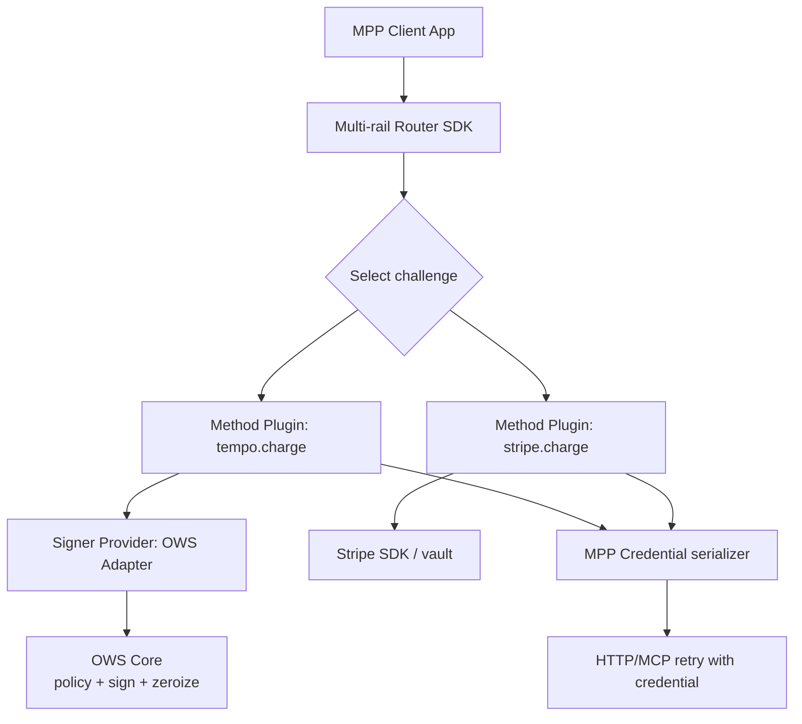
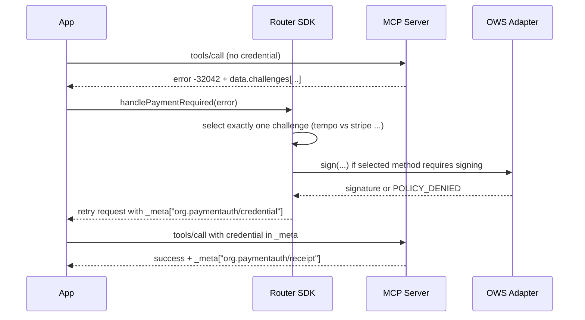

# OWS Compatibility for an MPP Multi‑Rail Router TypeScript SDK

## Executive summary

It is feasible to update/extend an MPP multi‑rail router and method‑selection TypeScript SDK to “support” the Open Wallet Standard by treating OWS as an **optional wallet/signing back-end** that certain payment methods (primarily crypto rails) can use to generate MPP credentials. OWS is explicitly a **local-first wallet specification for encrypted wallet storage, signing operations, policy enforcement, and multi-chain account derivation**, and it explicitly places **“on-chain service payment flows” out of scope** for the core spec—meaning OWS should slot underneath your router rather than replacing it. citeturn39view0

The integration is most natural for **Tempo/crypto-based MPP methods** that require signing and (sometimes) broadcasting EVM-like transactions or signing EIP‑712 “voucher” typed data. The most important practical constraint (as of the current public Node reference docs) is that **typed-data signing under API-token (agent) credentials is not yet supported in current implementations**, which directly impacts secure, policy-gated “agent token” support for Tempo session voucher signing (EIP‑712). citeturn7view5turn26view0

A good target design keeps the routing core payment-rail agnostic, and introduces an **OWS adapter** as (a) a pluggable signing provider usable by method plugins, and/or (b) a “wallet-backed account” shim that makes OWS look like an existing signer abstraction used by your method implementations (e.g., a Viem account-like interface). OWS itself defines three acceptable access profiles—**in-process bindings, local subprocess, or local service**—with strict requirements: deterministic credential-type handling (owner vs token), policy evaluation *before* decrypting token-backed secrets, and never exposing decrypted key material except via explicit export operations. citeturn8view5turn32view0

Finally, the router’s selection logic must remain correct across transports: the MCP transport spec says **multiple challenges are alternative payment options and the client must select exactly one**, and the client must not log or persist credentials. citeturn38view0 Any OWS-backed method must therefore be integrated in a way that (1) preserves deterministic challenge selection and (2) never leaks OWS credentials (passphrases/tokens) or resulting MPP credentials into logs/telemetry. citeturn32view0turn38view0

## Ecosystem fit and responsibility boundaries

OWS (created/announced by entity["company","MoonPay","crypto payments company"]) is intended to be a reusable “wallet layer” for agentic systems: it standardizes local vault artifacts, signing semantics, and a policy-gated delegation model so that an application or agent can request signatures without directly handling raw private keys. citeturn39view0turn32view0

OWS is not itself an MPP router, and the OWS core spec does **not** standardize the service-payment protocol flows that happen over HTTP/MCP. In fact, the spec explicitly calls “on-chain service payment flows” out of scope (along with distribution channels, public RPC selection, and hosted custody). citeturn39view0 This is a strong architectural hint: an MPP router should use OWS **as an internal signing authority** for certain rails, but should continue to handle:

- Challenge parsing, method selection, and retry orchestration across rails and transports.
- Budgeting/allow/deny policies at the “merchant/realm/service” level (unless you intentionally delegate portions into OWS executable policies).
- Receipt handling and reconciliation at the MPP layer.

MPP/mppx sits above that. For example, entity["organization","wevm","typescript tooling org"]’s `mppx` is a TypeScript SDK “built on the ‘Payment’ HTTP Authentication Scheme” and implements client/server flows including automatic handling of HTTP 402 challenges. citeturn15view0turn13search4 That protocol layer is where multi-rail routing belongs; OWS should be treated as one of the ways a method plugin can produce a valid `credential.payload`.

## Feasibility analysis by rail, intent, and transport

### What MPP methods need from OWS

On the OWS side, the Node reference SDK exposes operations for signing and sending EVM-family transactions and EIP‑712 typed data, plus creating policies and API keys (agent tokens). It includes:

- `signTransaction(wallet, chain, txHex, credential?, ...)` where `txHex` is raw hex bytes. citeturn27view3  
- `signAndSend(...)` which signs and broadcasts, optionally using an explicit `rpcUrl`. citeturn27view3turn10view0  
- `signTypedData(...)` (EVM only), but “API-token typed-data signing is not yet supported” in current implementations. citeturn7view5turn10view0  
- API keys via `ows_key_<64 hex chars>`, with token resolution by `SHA256(token)` and policy evaluation before decrypting token-backed wallet secrets. citeturn28view0turn12view5turn32view0  

On the MPP method side (taking Tempo as the representative crypto rail), the existing `mppx` Tempo client implementation shows two distinct signing needs:

- **Tempo charge** constructs token transfer calls and either:
  - “push” mode: broadcasts and sends a tx hash (`type: 'hash'`) in the credential, or  
  - “pull” mode: signs a transaction and sends the signed transaction (`type: 'transaction'`) to the server to broadcast. citeturn25view0  
- **Tempo session** signs **EIP‑712 typed vouchers** (via `signTypedData`) and includes those signatures in session credentials. citeturn26view0turn25view1  

OWS can support the charge path relatively directly (sign raw tx bytes, optionally broadcast). The session path is the key friction point: it relies on EIP‑712 typed data signing, and current OWS Node implementation notes typed-data signing is not supported for token (agent) credentials. citeturn7view5turn26view0

### Multi‑challenge selection behavior matters for OWS-backed methods

Both the HTTP and MCP payment specs treat multiple challenges as alternatives that the client must choose among:

- The Payment MCP transport spec: multiple challenges represent alternative payment options; client **must select exactly one**; challenge `id` must be cryptographically bound and echoed unchanged in the credential. citeturn38view0  
- The HTTP draft similarly states that when multiple challenges are returned, clients should select one and must send only one “Authorization: Payment” header. citeturn13search4  

This matters because OWS integration typically changes which methods are “available” (e.g., if you have an OWS wallet configured, `tempo.charge` becomes viable; if you do not, it should be filtered out). So your router’s “capability discovery” step must incorporate “is OWS configured and policy-permitted for this challenge?” as part of selection.

As a concrete example, `mppx`’s HTTP `Fetch` wrapper parses all challenges and then chooses the first challenge whose `(method,intent)` matches the client’s methods list order—i.e., the **client controls priority**. citeturn20view0 But its MCP transport adapter currently extracts only `error.data.challenges[0]`, which is incompatible with “must select exactly one challenge” semantics when multiple are present (it removes the client’s ability to choose based on capabilities/policy). citeturn21view0turn38view0 An OWS-enabled router should therefore treat multi-challenge selection as a core requirement across **both** transports.

### Summary table of “OWS usefulness” by common MPP paths

| MPP method/intention | Cryptographic operation | OWS capability match | Practical status |
|---|---|---|---|
| Tempo charge (push-by-client, send tx hash) | sign + broadcast transaction | `signAndSend` exists; `rpcUrl` optional | Feasible; requires tx hex preparation and a broadcast policy choice citeturn27view3turn10view0turn25view0 |
| Tempo charge (pull-by-server, send signed tx) | sign transaction and return signed tx bytes | `signTransaction` returns a signature; callers may need to re-encode a signed tx | Feasible but requires careful tx encoding/serialization glue between MPP method format and OWS’ “raw bytes” model citeturn27view3turn10view0turn25view0 |
| Tempo session (voucher signing) | EIP‑712 typed data signatures | `signTypedData` exists (EVM only) | Blocked for secure “agent token” use unless OWS adds token-based typed-data signing; owner-mode only is possible but weaker operationally citeturn10view0turn7view5turn26view0 |
| Stripe charge | non-crypto card/payment processor authentication | not in OWS scope | Not a fit; OWS is not a general credential vault for payment processors citeturn39view0turn14search4 |

## Target architecture for an OWS‑aware MPP router

### Architectural goal

Add OWS as a **pluggable signer backend** for methods that need cryptographic signing, without coupling the router core to any one wallet system.

This aligns with OWS’ own stance that access layers can vary (in-process, subprocess, local service), but must preserve core semantics: deterministic credential handling, policy-before-decrypt for token secrets, stable error meanings, and no secret exposure. citeturn8view5turn32view0turn39view0  

### Recommended layering

A robust integration model looks like:



OWS stays behind a signer provider boundary; only the resulting MPP credential is transmitted.

### Core TypeScript concepts to add

Below is a concrete, implementation-oriented spec for the additional abstractions.

#### Key types

```ts
// Core types for router + OWS integration (illustrative)

export type ChainId = string; // e.g., "eip155:8453" (CAIP-2)
export type WalletId = string;

export type WalletCredential =
  | { kind: "owner"; passphrase: string }
  | { kind: "agent"; apiToken: string }; // "ows_key_<...>"

export type SignOperation =
  | { type: "evm_tx"; unsignedTxHex: `0x${string}`; chainId: ChainId }
  | { type: "evm_typed_data"; typedDataJson: string; chainId: ChainId }
  | { type: "message"; message: string; chainId: ChainId; encoding?: "utf8" | "hex" };

export type SignResult =
  | { ok: true; signatureHex: `0x${string}`; recoveryId?: number }
  | {
      ok: false;
      code:
        | "WALLET_NOT_FOUND"
        | "CHAIN_NOT_SUPPORTED"
        | "INVALID_CREDENTIAL"
        | "POLICY_DENIED"
        | "API_KEY_NOT_FOUND"
        | "API_KEY_EXPIRED"
        | "UNSUPPORTED_OPERATION"
        | "UNKNOWN";
      message?: string;
    };
```

This mirrors OWS’ emphasis on stable error meanings (and the need not to “rewrite” denials into generic auth failures). citeturn10view0turn32view0

#### Wallet provider interface

```ts
export interface WalletProvider {
  readonly name: string;

  // Capability checks power routing filters before spending effort.
  supports(operation: SignOperation): boolean;

  // Optional preflight: can be used to filter when OWS policy would deny.
  // If not supported, router can fallback to "attempt sign and catch POLICY_DENIED".
  previewPolicy?(
    walletId: WalletId,
    credential: WalletCredential,
    operation: SignOperation,
  ): Promise<{ allowed: boolean; reason?: string }>;

  sign(
    walletId: WalletId,
    credential: WalletCredential,
    operation: SignOperation,
    opts?: { accountIndex?: number; vaultPath?: string },
  ): Promise<SignResult>;
}
```

**Why previewPolicy is optional:** OWS’ normative docs define the policy evaluation *as part of the signing path* and emphasize “no bypass flags” and “fail closed,” which is great for security but means some implementations may not expose a separate “evaluate only” endpoint. citeturn28view0turn32view0

### OWS adapter design choices

OWS defines acceptable access profiles: in-process binding, local subprocess, local service. citeturn8view5turn39view0 Your TypeScript OWS adapter should therefore implement a transport-agnostic “OWS client” and then ship three concrete backends.

| OWS access profile | How your TS router uses it | Pros | Cons |
|---|---|---|---|
| In-process binding | Import `@open-wallet-standard/core` and call functions directly | Lowest latency; simplest DX; aligns with OWS Profile A citeturn8view5turn27view3 | Shared address space with agent process; platform constraints (native add-on); harder isolation guarantees citeturn8view5turn11view0 |
| Local subprocess | Spawn `ows` CLI per operation/session and pass structured JSON over stdin/stdout | Better isolation boundary; easier to sandbox | Requires robust I/O protocol; higher latency; operational complexity; must still preserve OWS semantics citeturn8view5turn32view0 |
| Local service | Talk to a loopback daemon or local RPC endpoint (possibly MCP) | Centralized wallet service; multi-app reuse | Spec does not standardize wire format; must implement strong local auth; more moving parts citeturn8view5turn39view0 |

**Unspecified (important):** OWS’ normative “agent access layer” document deliberately does **not** mandate package names, method names, or transport encoding, and the core spec explicitly treats distribution and “public RPC endpoint selection” as out of scope. citeturn39view0turn8view5 Any networked/MCP-facing OWS calls are therefore **implementation-defined** today; your router should treat them as optional backends, not assumptions.

### Mapping OWS signing to MPP credential creation

The Payment MCP transport spec requires the client to echo the complete challenge unchanged and supply a method-specific payload, optionally including a `source` identifier. citeturn38view0turn25view0

A clean integration pattern is:

1. Router selects a challenge (Tempo vs Stripe, etc.).
2. Tempo method plugin converts challenge request into:
   - an unsigned tx payload to sign (charge), or  
   - typed data (session/voucher).
3. WalletProvider (OWS adapter) returns a signature (and possibly recovery id).
4. Method plugin constructs the exact `payload` schema required by the method, then serializes the MPP credential and retries the request.

Because OWS’ `signTransaction` returns a signature (not necessarily a fully signed tx blob), for “pull” approaches where the server expects a signed transaction, you’ll often need an additional step: **recombine `{ unsignedTx, signature } → signedTxHex`** in the method plugin. This is an integration detail, but it’s where most real-world bugs happen (wrong signing preimage, wrong chain id rules, wrong `v`/recovery handling). OWS’ normative signing doc emphasizes stable semantics and includes “serialized transaction bytes as hex” as the current input format; it also explicitly warns of no built-in nonce manager/serialization. citeturn10view0turn10view2

### Transport flows with OWS in the loop

#### HTTP 402 flow

```mermaid
sequenceDiagram
  participant App as App
  participant Router as Router SDK
  participant Svc as Service (HTTP)
  participant Ows as OWS Adapter
  participant Vault as OWS Vault

  App->>Svc: Request paid resource
  Svc-->>App: 402 + challenges (tempo, stripe, ...)
  App->>Router: handle402(response, context)
  Router->>Router: select challenge (policy + heuristics)
  alt selected method requires signing (tempo)
    Router->>Ows: sign(walletId, token/passphrase, operation)
    Ows->>Vault: resolve token + evaluate policies + decrypt + sign + zeroize
    Ows-->>Router: signature (or POLICY_DENIED)
    Router-->>App: retry with Authorization: Payment <credential>
    App->>Svc: Retried request with credential
    Svc-->>App: 200 + receipt
  else selected method non-crypto (stripe)
    Router-->>App: obtain processor credential; retry
  end
```

This flow relies on: (a) correct challenge selection, (b) OWS policy-before-decrypt behavior for token secrets, and (c) MPP correctness in echoing the challenge. citeturn20view0turn28view0turn38view0

#### MCP JSON-RPC flow



Key MCP requirements: error code `-32042`, client must select exactly one challenge, and the credential/receipt meta keys are `org.paymentauth/credential` and `org.paymentauth/receipt`. citeturn38view0turn21view0

## Security and threat model for OWS‑enabled routing

This combined system has **two distinct secret classes**:

1. **OWS credentials**: owner passphrases and agent API tokens (`ows_key_...`). OWS requires treating both as secrets, avoiding echoing them in logs/errors, evaluating scope/policies before decrypting token-backed secrets, and zeroizing derived buffers. citeturn32view0turn28view0turn11view4  
2. **MPP credentials**: the payment proof payload (signatures, tx hashes, processor tokens). The payment MCP transport spec explicitly warns that credentials may contain sensitive data and that clients **must not log or persist credentials beyond immediate use**; servers must not log full credential payloads (including tracing/analytics). citeturn38view0  

A credible threat model for the router + OWS integration should cover at least:

**Malicious server challenges**  
A server can return crafted challenges to manipulate method choice or trick the client into paying in an unexpected way, especially when multiple challenges are offered. Specs require the client to select a single challenge and echo it unchanged, and they require challenge `id` binding to key fields and canonicalization/hashing of the `request`. citeturn38view0turn13search4  
Mitigation: treat “challenge selection” as a policy decision, not a convenience. For OWS-backed methods, use OWS policies (e.g., `allowed_chains`) to prevent signing on unapproved chains regardless of what the server offers. citeturn28view0turn9view0

**OWS token exfiltration and replay**  
OWS’ model is “token-as-capability”: the API token plus local key file enables decrypt+sign, with policies enforced before decrypt. Tokens are 256-bit random values; the key file stores `token_hash = SHA256(token)` and encrypted wallet secrets re-encrypted under HKDF-derived keys. citeturn28view0turn12view5  
Mitigation: keep router telemetry and debug tooling “credential-redacted by construction.” Avoid environment variables for long-lived secrets; OWS notes env vars are the weakest delivery mechanism and must be cleared promptly if used. citeturn11view4turn12view3turn32view0

**Policy bypass and failure modes**  
OWS states that policy evaluation must happen before token-backed secret decryption, and its executable policy mechanism fails closed (timeouts, malformed JSON, executable errors deny). citeturn9view1turn32view0turn28view0  
Mitigation: in your integration, ensure that any “fallback signer” does not silently activate when OWS returns `POLICY_DENIED`. “Fail clearly” is explicitly required for omitted optional features. citeturn39view0turn32view0

**Filesystem permission and local tampering**  
OWS mandates strict permissions for `wallets/` and `keys/` (and requires refusing to operate if those directories are world/group readable). Policies are intentionally non-secret and can have relaxed permissions, but policy executables add a local attack surface. citeturn12view1turn9view1  
Mitigation: treat OWS as a privileged component; for enterprise environments prefer the local-service/subprocess profiles with OS-level isolation. citeturn8view5turn11view0

**High-frequency signing for streaming payments**  
OWS notes scrypt-derived decrypts add latency and recommends a short-lived in-memory cache with strict TTL, bounded size, mlock, and signal-driven clearing. citeturn11view2turn11view0  
This becomes crucial if you want to use OWS in a streaming micropayment loop—exactly the scenario where you’d otherwise be tempted to keep raw keys in process.

## Testing, conformance, and operationalization

OWS’ conformance doc is unusually explicit about interoperability artifacts: conforming implementations should ship/consume machine-readable test vectors for wallet/API key decryption, policy evaluation, chain derivation, and signing, and must preserve error meanings from the signing interface. citeturn32view0turn10view0 This maps cleanly onto how you should test an OWS-enabled router:

- **Unit tests** for the OWS adapter:
  - token credential detection and safe redaction behavior (no secrets in thrown errors),
  - mapping of OWS error codes (`POLICY_DENIED`, `API_KEY_EXPIRED`, etc.) into your router’s error surface without semantic drift. citeturn10view0turn32view0
- **Integration tests** for method plugins:
  - a deterministic test vault path with a known wallet and API key file format (`ows_version = 2`, policy `version = 1`),
  - known signing vectors for the relevant chain family, aligned to OWS’ recommendation of “one signing vector per supported chain family.” citeturn39view0turn32view0
- **Transport conformance tests**:
  - ensure that both HTTP and MCP flows handle multi-challenge responses correctly (select exactly one, echo unchanged, do not send multiple credentials). citeturn38view0turn13search4turn20view0

Observability should be designed around the constraints that both OWS and MPP impose:

- OWS requires avoiding decrypted secret material in logs/telemetry and treating passphrases/tokens as secrets; audit logs must not contain raw credentials or keys. citeturn32view0turn11view4  
- The payment MCP transport spec also forbids logging full payment credential payloads (and calls out crash dumps, distributed tracing, and analytics explicitly). citeturn38view0  

A practical approach is to instrument only **structural events**:
- selected method/intent,
- challenge id (and possibly a hash of realm + method),
- signing outcome code (success vs policy_denied),
- receipt reference (tx hash / invoice id) and reconciliation status.

Chart suggestion (for validating OWS integration quality): a histogram of **end-to-end “402 → paid success” latency** split by (a) access profile (in-process vs subprocess) and (b) signing operation type (tx vs typed data), plus a separate time series of `POLICY_DENIED` rates per realm/method to detect misconfigured policies or malicious challenge patterns. (Metrics instrumentation requirements are implied by “no credential logging” constraints; the chart must be built from redacted identifiers only.) citeturn32view0turn38view0turn11view2

## Roadmap for adding OWS support

### Milestone principles

1. Keep the router core pure: OWS is an optional backend and should not become a hard dependency (especially because OWS Node bindings are native/FFI and platform-dependent). citeturn39view0turn34view0  
2. Make MCP multi-challenge selection correct early: the spec requires selection across all challenges; a “first challenge wins” approach is semantically wrong. citeturn38view0turn21view0  
3. Close the typed-data gap explicitly: Tempo session voucher signing uses EIP‑712 typed data today, and current OWS token limitations block the secure “agent token” path. citeturn26view0turn7view5  

### Prioritized milestones with effort estimates

| Milestone | What ships | Effort |
|---|---|---|
| OWS adapter package | `@router/ows` implementing `WalletProvider` for in-process Node binding + subprocess CLI backend; strict redaction + error mapping | Medium |
| OWS-backed Tempo charge method | New method plugin variant (or signer shim) that can produce Tempo `charge` credentials using OWS signing; supports both push (tx hash) and pull (signed tx assembly) paths | Medium |
| MCP multi-challenge selection | Fix MCP adapter to consider `challenges[]` as alternatives and run the same selection algorithm as HTTP; ensure only one credential transmitted | Small–Medium |
| OWS token typed-data signing enablement | Upstream contribution to implement token-based `signTypedData` (and clarify how policies apply to typed-data signing), plus conformance vectors | Large |
| Policy bridge for budgets | Optional: translate router budgets into OWS executable policies (e.g., per-recipient spend caps) using `PolicyContext` and fail-closed semantics | Medium–Large |

### First three concrete deliverables

1. **A minimal OWS integration spec + adapter skeleton** (TypeScript): the `WalletProvider` interface, credential redaction rules, and a Node-binding backend that can sign EVM transactions via `signTransaction` and broadcast via `signAndSend`. citeturn27view3turn32view0turn10view0  
2. **An OWS-enabled “tempo.charge” proof-of-concept** that can satisfy an MPP `tempo.charge` challenge by producing a credential payload compatible with the existing schema used in `mppx` (hash or transaction mode). citeturn25view0turn20view0  
3. **A correctness patch for MCP challenge handling** so method selection works across multiple payment options, aligning with the MCP transport spec’s “select exactly one challenge” requirement. citeturn38view0turn21view0