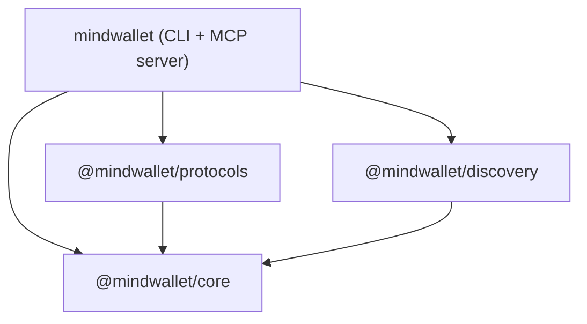

# Architecture

## Package Architecture

The layers compose cleanly — each package is independently usable and independently versioned.

## Selection Pipeline

When a 402 response is received, mindwallet runs a multi-stage selection pipeline:

1. **Detect** — parse `PAYMENT-REQUIRED` (x402), `WWW-Authenticate: Payment` (MPP), and response body (SIWX) headers
2. **Normalize** — convert protocol-specific challenges into `NormalizedPayment` objects
3. **Filter** — apply policy rules (budget caps, deny/allow protocol lists)
4. **Score** — weight candidates by cost, latency, success rate, and warm channel availability
5. **Select** — pick the highest-scoring candidate
6. **Credential** — sign the payment/auth via the wallet adapter
7. **Retry** — re-issue the request with the credential attached

## Wallet Adapters

mindwallet supports two wallet modes via the `WalletAdapter` interface:

| Adapter | Protocols | Use Case |
|---------|-----------|----------|
| `OwsWalletAdapter` | SIWX | Production custody with OWS vault |
| `PrivateKeyWalletAdapter` | SIWX + x402 + Tempo | CI pipelines, testing, quick start |

The private key adapter enables all three protocols because it provides a viem `Account` object that x402 and Tempo methods require for signing.

## Protocol Methods

| Protocol | Challenge Source | Credential |
|----------|-----------------|------------|
| x402 | `PAYMENT-REQUIRED` header | EIP-3009 `transferWithAuthorization` signature |
| Tempo | `WWW-Authenticate: Payment` header | Signed charge/session transaction |
| SIWX | 402 response body `sign-in-with-x` | Signed SIWE message |
